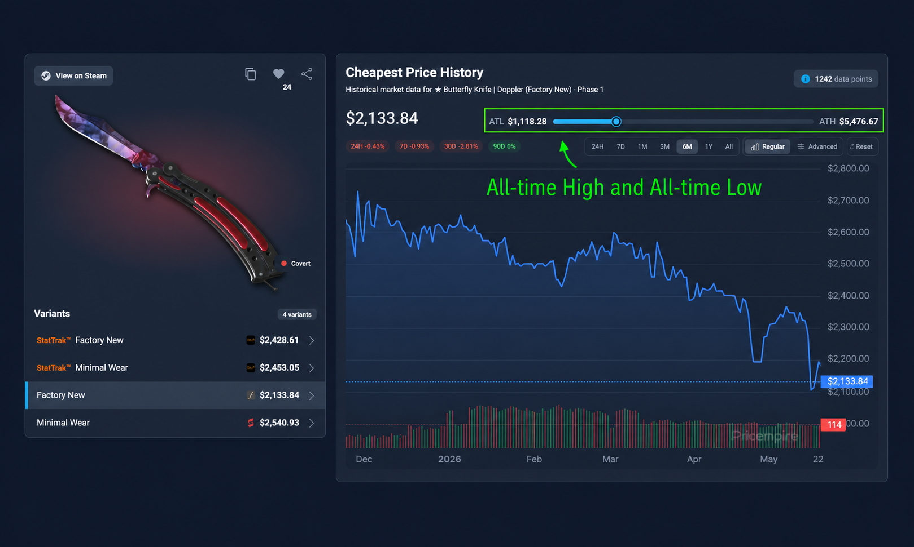

  

<h1 align="center">PricempirePlus</h1>

  <strong>A sharper CS2 item workflow for Pricempire.</strong> 
  Price context, better section placement, and instant item searches in one lightweight Chrome extension.

  
  
  
  

 

  

  <strong>All-time range at a glance.</strong> See where today's price sits between ATL and ATH, based on Pricempire price data since tracking began for the item, without leaving the item page.

## Instant Item Search

  

  Select text. Right-click. Jump straight into a Pricempire search.

## Features

| Feature | What it adds | Where it works |
| :--- | :--- | :--- |
| **ATL / ATH price range** | A visual slider showing the current value between the item's recorded low and high prices. | Pricempire CS2 item pages |
| **Available offers placement** | Repositions the offers section above similar items for a tighter evaluation flow. | Pricempire CS2 item pages |
| **Layout toggle** | Turns the offers repositioning behavior on or off from the extension popup. | Extension popup |
| **Selected-text search** | Adds `Search Pricempire for "<selected text>"` to the context menu. | Any selectable page text |

## The Control Surface

| Setting | Default | Effect |
| :--- | :---: | :--- |
| `Move Market Offers to Bottom` | On | Places the market offers block immediately before `Similar Items` on item pages. |

> The popup toggle controls section placement only. Price range insight appears automatically on supported item pages.

## Install Locally

1. Download or clone this repository.
2. Open `chrome://extensions` in Chrome.
3. Enable **Developer mode**.
4. Select **Load unpacked** and choose the repository folder.
5. Open a Pricempire CS2 item page and reload it once.

## Permissions & Privacy

| Permission | Why it is used |
| :--- | :--- |
| `storage` | Saves the market-offers placement toggle in Chrome sync storage. |
| Pricempire item-page access | Adds price range insight and rearranges the optional market-offers section on supported pages. |
| Context menus | Adds the selected-text shortcut for searching Pricempire. |

PricempirePlus does not add account sign-in or analytics. Read the full
[privacy policy](https://ne0lines.github.io/PricempirePlus/).

---

  <strong>PricempirePlus</strong> 
  Built for faster, more informed Pricempire item checks.

